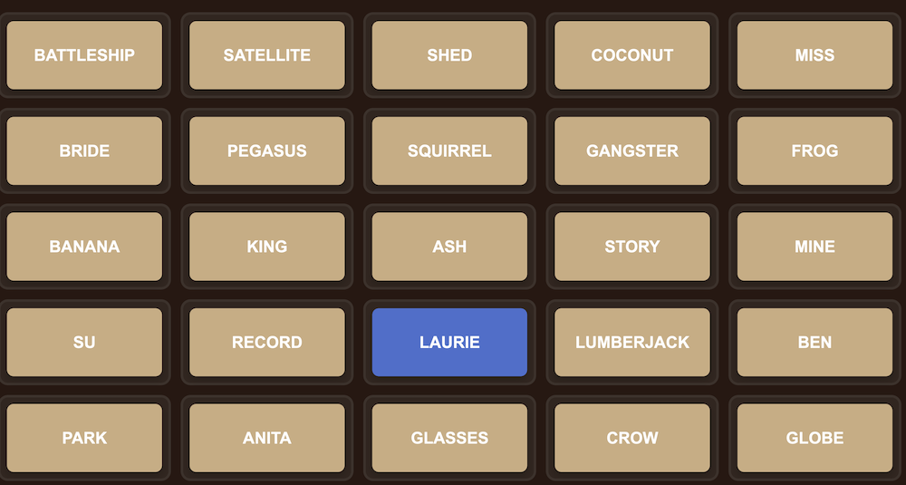

# Display Board for Codenames

This project is for playing Codenames on a large shared screen (eg. TV).

It will display a 5x5 grid with exactly the same set of Codenames words.

Clicking on the words will toggle between the different colors (tan, grey, blue, red and black), denoting the different states.

The spymasters will need to use a real key card from the boardgame, or they can use the **Codenames Gadget** app,
which will display the key card on a mobile device.

Refreshing the browser will generate a new board, so be careful not to refresh while in the middle of gameplay.

[**Link to board**](https://lpoon94087.github.io/codenames/board.html)

[Codenames Gadget for iOS](https://apps.apple.com/us/app/codenames-gadget/id1032754439)

[Codenames Gadget for android](https://play.google.com/store/apps/details?id=com.czechgames.codenames&hl=en_US&pli=1)

## Addon words
To add extra words to the basic set, add a query parameter "addon" with the words separated by comma.
Eg.
> https://lpoon94087.github.io/codenames/board.html?addon=LAURIE,SU,BEN,ANITA
